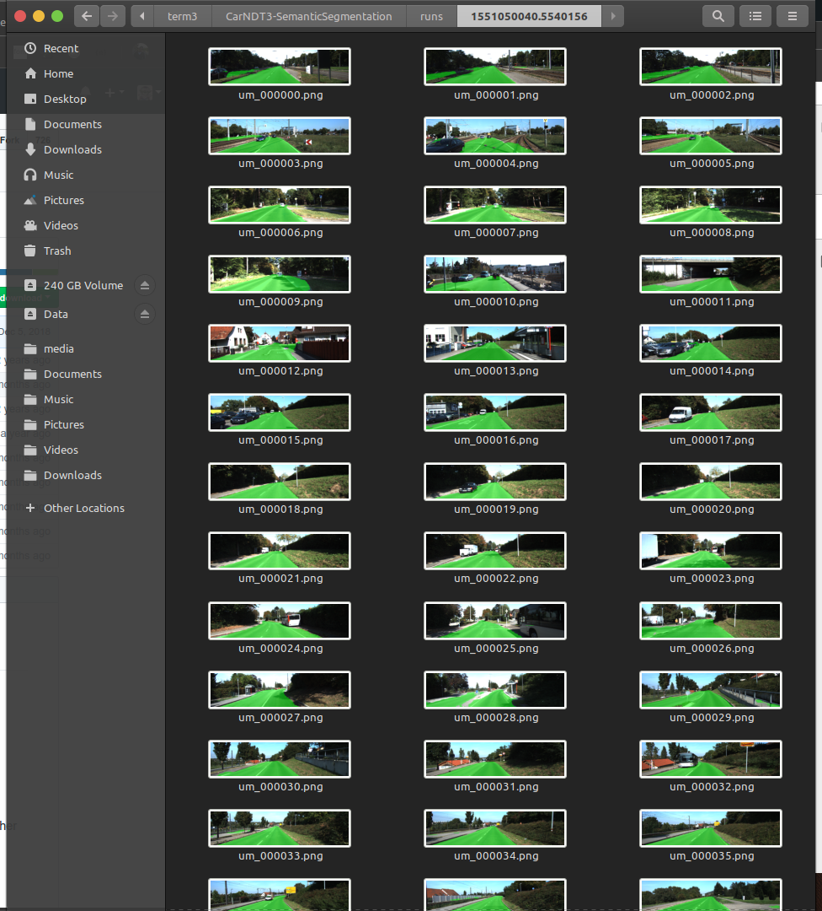

# CarND-Semantic Segmentation

Self-Driving Car Engineer Nanodegree Program

Selective Project ( 2nd project ) - Semantic Segmentation

# Project Rubric

### Build the Neural Net 

- load_vgg ( line 31 - 46)

```python
    vgg_tag = 'vgg16'
    tf.saved_model.loader.load(sess, [vgg_tag], vgg_path)
```

- layers ( line 61 - 82 )

```python
    # 1x1 convolution layer with road / not-road features only
    conv_1by1_l7 = tf.layers.conv2d(vgg_layer7_out, num_classes, 1, padding='SAME',
                                 kernel_regularizer=tf.contrib.layers.l2_regularizer(1e-3))

    # upscaling size/ add features
    output = tf.layers.conv2d_transpose(conv_1by1_l7, 512, 4, strides=(2,2), padding='SAME',
                                        kernel_regularizer=tf.contrib.layers.l2_regularizer(1e-3))

    # skip connections / add to upscaled output
    output = tf.add(output, vgg_layer4_out)

    # upscaling size/ reduce features
    output = tf.layers.conv2d_transpose(output, 256, 4, strides=(2,2), padding='SAME',
                                        kernel_regularizer=tf.contrib.layers.l2_regularizer(1e-3))

    # skip connections / add to upscaled output
    output = tf.add(output, vgg_layer3_out)

    # upscaling size/ reduce features to road OR not-road
    output = tf.layers.conv2d_transpose(output, num_classes, 16, strides=(8,8), padding='SAME',
                                        kernel_regularizer=tf.contrib.layers.l2_regularizer(1e-3), name='nn_final_output')

    return output
```

- optimize ( line 96 - 104 ) 

```python
    logits = tf.reshape(nn_last_layer, (-1, num_classes))

    # add loss function
    cross_entropy_loss = tf.reduce_mean(tf.nn.softmax_cross_entropy_with_logits(logits=logits, labels=correct_label))
    optimizer = tf.train.AdamOptimizer(learning_rate=learning_rate)
    # training_op
    training_operation = optimizer.minimize(cross_entropy_loss)

    return logits, training_operation, cross_entropy_loss
```

- train_nn ( line 125 - 135 )

```python
    # initialize global variables
    sess.run(tf.global_variables_initializer())

    # going through the batches of images i.e. epoch
    for epoch in range(epochs):
        for (input_img, gt_img) in get_batches_fn(batch_size):
            _, loss = sess.run([train_op, cross_entropy_loss], feed_dict={input_image: input_img,
                               correct_label: gt_img,
                               keep_prob: 0.7,
                               learning_rate: 5e-04})
        print("Loss of {} at epoch {}/{}".format(loss, epoch, epochs))
```

### Neural Net Training

- On average, the model decreases loss over time

```bash
2019-02-24 23:02:06.110940: W tensorflow/core/graph/graph_constructor.cc:1265] Importing a graph with a lower producer version 21 into an existing graph with producer version 27. Shape inference will have run different parts of the graph with different producer versions.
Loss of 0.2654869556427002 at epoch 0/20
Loss of 0.2095489501953125 at epoch 1/20
Loss of 0.12121441960334778 at epoch 2/20
Loss of 0.08499448746442795 at epoch 3/20
Loss of 0.13722290098667145 at epoch 4/20
Loss of 0.1067190170288086 at epoch 5/20
Loss of 0.19996142387390137 at epoch 6/20
Loss of 0.08458487689495087 at epoch 7/20
Loss of 0.03854444995522499 at epoch 8/20
Loss of 0.09239672869443893 at epoch 9/20
Loss of 0.08732126653194427 at epoch 10/20
Loss of 0.07391674071550369 at epoch 11/20
Loss of 0.05619486793875694 at epoch 12/20
Loss of 0.05399750545620918 at epoch 13/20
Loss of 0.058325909078121185 at epoch 14/20
Loss of 0.06825245916843414 at epoch 15/20
Loss of 0.04549416899681091 at epoch 16/20
Loss of 0.04900093749165535 at epoch 17/20
Loss of 0.05548911541700363 at epoch 18/20
Loss of 0.062272507697343826 at epoch 19/20
Training Finished. Saving test images to: ./runs/1551050040.5540156
root@b507b42407e2:~/picolo/SelfCourseWork/udacity_sdc_prj/term3/CarNDT3-SemanticSegmentation#
```

- Hyper parameters

Number of epoch = 20 
batch size = 5 
Optimizer : cross-entropy Adam

- Does the project correctly label the road ?



Refer to runs folder

-----

### Introduction
In this project, you'll label the pixels of a road in images using a Fully Convolutional Network (FCN).

### Setup
##### GPU
`main.py` will check to make sure you are using GPU - if you don't have a GPU on your system, you can use AWS or another cloud computing platform.
##### Frameworks and Packages
Make sure you have the following is installed:
 - [Python 3](https://www.python.org/)
 - [TensorFlow](https://www.tensorflow.org/)
 - [NumPy](http://www.numpy.org/)
 - [SciPy](https://www.scipy.org/)

You may also need [Python Image Library (PIL)](https://pillow.readthedocs.io/) for SciPy's `imresize` function.

##### Dataset
Download the [Kitti Road dataset](http://www.cvlibs.net/datasets/kitti/eval_road.php) from [here](http://www.cvlibs.net/download.php?file=data_road.zip).  Extract the dataset in the `data` folder.  This will create the folder `data_road` with all the training a test images.

### Start
##### Implement
Implement the code in the `main.py` module indicated by the "TODO" comments.
The comments indicated with "OPTIONAL" tag are not required to complete.
##### Run
Run the following command to run the project:
```
python main.py
```
**Note:** If running this in Jupyter Notebook system messages, such as those regarding test status, may appear in the terminal rather than the notebook.

#### Example Outputs
Here are examples of a sufficient vs. insufficient output from a trained network:

Sufficient Result          |  Insufficient Result
:-------------------------:|:-------------------------:
  |  

### Submission
1. Ensure you've passed all the unit tests.
2. Ensure you pass all points on [the rubric](https://review.udacity.com/#!/rubrics/989/view).
3. Submit the following in a zip file.
 - `helper.py`
 - `main.py`
 - `project_tests.py`
 - Newest inference images from `runs` folder  (**all images from the most recent run**)
 
### Tips
- The link for the frozen `VGG16` model is hardcoded into `helper.py`.  The model can be found [here](https://s3-us-west-1.amazonaws.com/udacity-selfdrivingcar/vgg.zip).
- The model is not vanilla `VGG16`, but a fully convolutional version, which already contains the 1x1 convolutions to replace the fully connected layers. Please see this [post](https://s3-us-west-1.amazonaws.com/udacity-selfdrivingcar/forum_archive/Semantic_Segmentation_advice.pdf) for more information.  A summary of additional points, follow. 
- The original FCN-8s was trained in stages. The authors later uploaded a version that was trained all at once to their GitHub repo.  The version in the GitHub repo has one important difference: The outputs of pooling layers 3 and 4 are scaled before they are fed into the 1x1 convolutions.  As a result, some students have found that the model learns much better with the scaling layers included. The model may not converge substantially faster, but may reach a higher IoU and accuracy. 
- When adding l2-regularization, setting a regularizer in the arguments of the `tf.layers` is not enough. Regularization loss terms must be manually added to your loss function. otherwise regularization is not implemented.

### Why Layer 3, 4 and 7?
In `main.py`, you'll notice that layers 3, 4 and 7 of VGG16 are utilized in creating skip layers for a fully convolutional network. The reasons for this are contained in the paper [Fully Convolutional Networks for Semantic Segmentation](https://arxiv.org/pdf/1605.06211.pdf).

In section 4.3, and further under header "Skip Architectures for Segmentation" and Figure 3, they note these provided for 8x, 16x and 32x upsampling, respectively. Using each of these in their FCN-8s was the most effective architecture they found. 

### Optional sections
Within `main.py`, there are a few optional sections you can also choose to implement, but are not required for the project.

1. Train and perform inference on the [Cityscapes Dataset](https://www.cityscapes-dataset.com/). Note that the `project_tests.py` is not currently set up to also unit test for this alternate dataset, and `helper.py` will also need alterations, along with changing `num_classes` and `input_shape` in `main.py`. Cityscapes is a much more extensive dataset, with segmentation of 30 different classes (compared to road vs. not road on KITTI) on either 5,000 finely annotated images or 20,000 coarsely annotated images.
2. Add image augmentation. You can use some of the augmentation techniques you may have used on Traffic Sign Classification or Behavioral Cloning, or look into additional methods for more robust training!
3. Apply the trained model to a video. This project only involves performing inference on a set of test images, but you can also try to utilize it on a full video.
 
### Using GitHub and Creating Effective READMEs
If you are unfamiliar with GitHub , Udacity has a brief [GitHub tutorial](http://blog.udacity.com/2015/06/a-beginners-git-github-tutorial.html) to get you started. Udacity also provides a more detailed free [course on git and GitHub](https://www.udacity.com/course/how-to-use-git-and-github--ud775).

To learn about REAMDE files and Markdown, Udacity provides a free [course on READMEs](https://www.udacity.com/courses/ud777), as well. 

GitHub also provides a [tutorial](https://guides.github.com/features/mastering-markdown/) about creating Markdown files.
